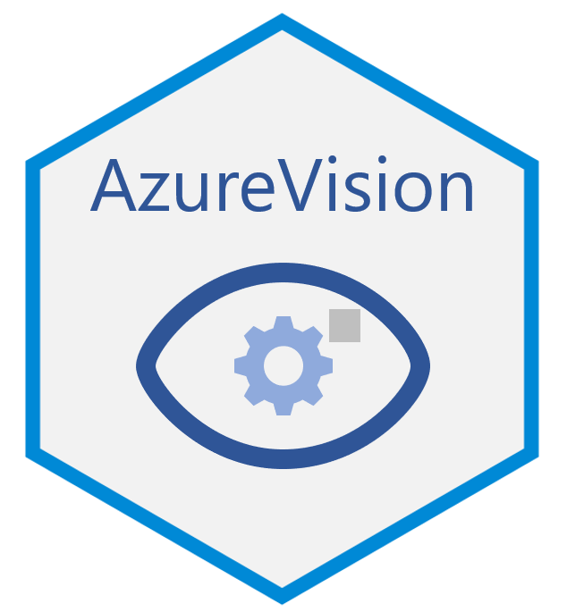

# AzureVision 

[](https://cran.r-project.org/package=AzureVision)

[](https://asiadatascience.visualstudio.com/AzureR/_build/latest?definitionId=13&branchName=master)

An R frontend to [Azure Computer Vision](https://azure.microsoft.com/services/cognitive-services/computer-vision/) and [Azure Custom Vision](https://azure.microsoft.com/services/cognitive-services/custom-vision-service/), building on the low-level functionality provided by the [AzureCognitive](https://github.com/Azure/AzureCognitive) package. These services let you leverage the cloud to carry out visual recognition tasks using advanced image processing models, without needing powerful hardware of your own.

The primary repo for this package is at https://github.com/Azure/AzureVision; please submit issues and PRs there. It is also mirrored at the Cloudyr org at https://github.com/cloudyr/AzureVision. You can install the development version of the package with `devtools::install_github("Azure/AzureVision")`.

## Computer Vision

To communicate with the Computer Vision service, call the `computervision_endpoint` function with the service URL and key. Rather than a key, you can also supply an OAuth token obtained with the AzureAuth package.

```r
library(AzureVision)

vis <- computervision_endpoint(
    url="https://accountname.cognitiveservices.azure.com/",
    key="account_key"
)

# images can be specified as a filename, Internet URL, or raw vector
bill_url <- "https://news.microsoft.com/uploads/2014/09/billg1_print.jpg"
analyze(vis, bill_url)
# $categories
#      name    score
# 1 people_ 0.953125

describe(vis, bill_url)
# $tags
#  [1] "person"   "man"      "suit"     "clothing" "necktie"  "wearing"  "glasses"  "looking"  "holding"  "standing" "older"   
# [12] "posing"   "business" "old"      "dressed"  "front"    "sitting"  "black"    "hat"      "white"    "sign"     "phone"   

# $captions
#                                text confidence
# 1 Bill Gates wearing a suit and tie  0.9954072
```

## Custom Vision

Custom Vision defines two different types of endpoint: a training endpoint, and a prediction endpoint. To communicate with these, call the `customvision_training_endpoint` and `customvision_prediction_endpoint` functions with the service URL and key.

```r
# training a model
cusvis <- customvision_training_endpoint(
    url="https://location.api.cognitive.microsoft.com/",
    key="training_key"
)

# different projects can exist on the one endpoint
list_projects(cusvis)

# create a classification project (one tag/label per image)
proj <- create_classification_project(cusvis, "myproject")

img1 <- dir("path/to/images/tag1", full.names=TRUE)
img2 <- dir("path/to/images/tag2", full.names=TRUE)
add_images(proj, img1, tags="tag1")
add_images(proj, img2, tags="tag2")

# train the model
mod <- train_model(proj)

# publish to the prediction resource (use AzureRMR framework to get resource ID)
pred_res <- AzureRMR::get_azure_login("mytenant")$
    get_subscription("sub_id")$
    get_resource_group("rgname")$
    get_cognitive_service("cusvis_prediction")

publish_model(mod, "mymodel", pred_res)

# get predictions from the prediction endpoint
cusvis_pred <- customvision_prediction_endpoint(
    url="https://location.api.cognitive.microsoft.com/",
    key="prediction_key"
)

# must supply project ID to access the published service
project_id <- proj$project$id
cusvis_service <- classification_service(cusvis_pred, project_id, "mymodel")

predict(cusvis_service, "testimage.jpg")
```

## Resource Manager interface

You can create Computer Vision and Custom Vision resources using the AzureRMR framework.

For Computer Vision, the available service tiers are `F0` (free, limited to 20 API calls per minute and 5k calls per month) and `S1` (up to 10 calls per second). For Custom Vision, the tiers are `F0` (free, limited to 2 projects for training and 10k transactions/month for prediction) and `S0`. Note that Custom Vision requires at least _two_ resources: one for training, and the other for prediction.

```r
rg <- AzureRMR::get_azure_login("yourtenant")$
    get_subscription("sub_id")$
    get_resource_group("rgname")

# Computer Vision
rg$create_cognitive_service("myvis", service_type="ComputerVision", service_tier="S1")

# Custom Vision (training and prediction)
rg$create_cognitive_service("mycustvis", service_type="CustomVision", service_tier="S0")
rg$create_cognitive_service("mycustvispred", service_type="CustomVision.Prediction", service_tier="S0")
```

----
<p align="center"><a href="https://github.com/Azure/AzureR"></a></p>
