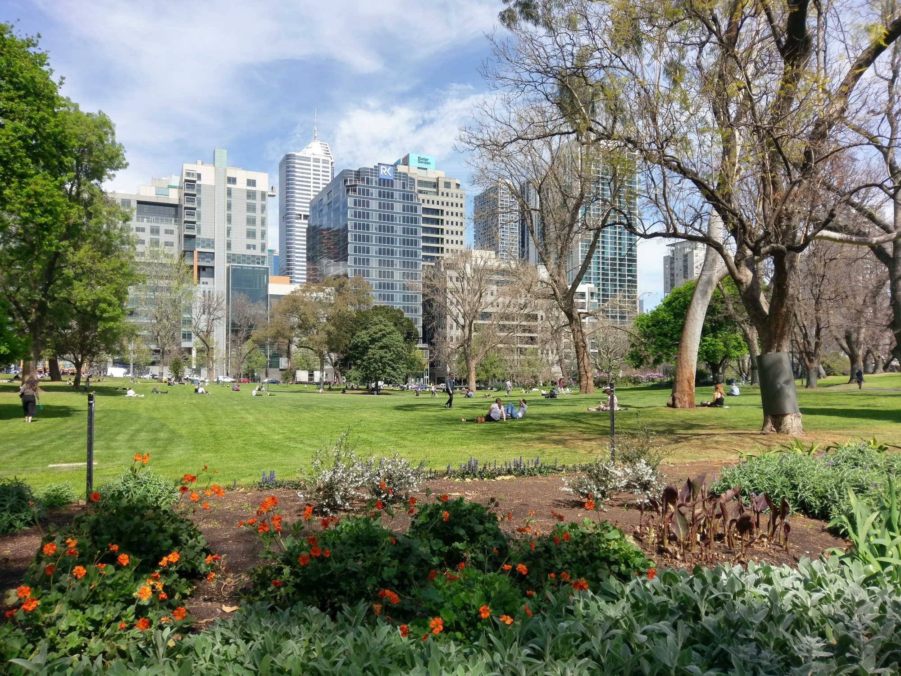
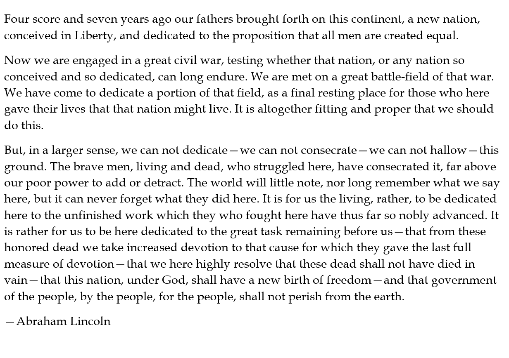

To communicate with the Computer Vision service, call the `computervision_endpoint` function with the service URL and key. Rather than a key, you can also supply an OAuth token obtained with the AzureAuth package.

```r
library(AzureVision)

vis <- computervision_endpoint(
    url="https://accountname.cognitiveservices.azure.com/",
    key="account_key"
)
```

AzureVision supports all the Computer Vision API calls:

- `analyze` extracts visual features from the image. To obtain more detailed features, specify the `domain` and/or `feature_types` arguments as appropriate.
- `describe` attempts to provide a text description of the image.
- `detect_objects` detects objects in the image.
- `area_of_interest` attempts to find the "interesting" part of an image, meaning the most likely location of its subject.
- `tag` returns a set of words that are relevant to the content of the image. Not to be confused with the `add_tags` or `add_image_tags` functions that are part of the Custom Vision API.
- `categorize` attempts to place the image into a list of predefined categories.
- `read_text` performs optical character recognition (OCR) on the image.
- `list_computervision_domains` returns the predefined domain-specific models that can be queried by `analyze` for deeper analysis. Currently there are two domains: celebrities and landmarks.
- `make_thumbnail` generates a thumbnail of the image.

## Sample images

These are the images we'll use to illustrate how the package works.

|Filename|Description|Picture|
|:------:|:---------:|:-----:|
|`bill.jpg`|A portrait of Bill Gates||
|`park.jpg`|A picture of a city park||
|`gettysburg.jpg`|The text of the Gettysburg Address||

An image to send to the endpoint can be specified as a filename, a publicly accessible Internet URL, or a raw vector. For example, these calls are equivalent, assuming the underlying image is the same:

```r
# from the Internet
analyze(vis, "https://example.com/foo.jpg")

# local file
analyze(vis, "~/pics/foo.jpg")

# read the picture into a raw vector
foo <- readBin("~/pics/foo.jpg", "raw", file.size("~/pics/foo.jpg"))
analyze(vis, foo)
```

## Calls

### `analyze`

```r
# analyze Bill's portrait
analyze(vis, "bill.jpg")
```

```
$categories
     name    score
1 people_ 0.953125
```

`analyze` has optional arguments `domain`, for choosing a domain-specific model with which to analyze the image; and `feature_types`, to specify additional details to return.

```r
analyze(vis, "bill.jpg", domain="celebrities")
```
```
$categories
     name    score                                       celebrities
1 people_ 0.953125 Bill Gates, 0.999981284141541, 276, 139, 211, 211
```

```r
analyze(vis, "bill.jpg", feature_types=c("faces", "objects"))
```
```
$faces
  age gender faceRectangle.left faceRectangle.top faceRectangle.width faceRectangle.height
1  50   Male                274               138                 210                  210

$objects
  rectangle.x rectangle.y rectangle.w rectangle.h object confidence
1         308         444         102         243    tie      0.652
```

### `describe`

```r
describe(vis, "bill.jpg")
```
```
$tags
 [1] "person"   "man"      "suit"     "clothing" "wearing"  "glasses"  "holding"  "standing" "looking"
[10] "front"    "posing"   "business" "older"    "dressed"  "sign"     "smiling"  "old"      "black"
[19] "phone"    "woman"    "people"

$captions
                               text confidence
1 Bill Gates wearing a suit and tie  0.9933712
```

### `detect_objects`

```r
detect_objects(vis, "park.jpg")
```
```
  rectangle.x rectangle.y rectangle.w rectangle.h   object confidence parent.object parent.confidence
1         624         278         132         351 building      0.637          <NA>                NA
2           3          22         314         843     tree      0.655         plant             0.658
3         749         353         284         380 building      0.544          <NA>                NA
4        1011           0         989         918     tree      0.719         plant             0.757
```

### `area_of_interest`

```r
area_of_interest(vis, "bill.jpg")
```
```
  x   y   w   h 
  0  45 750 749 
```

### `tag`

```r
head(tag(vis, "park.jpg"))
```
```
      name confidence hint
1    grass  0.9999686 <NA>
2     tree  0.9996704 <NA>
3  outdoor  0.9990110 <NA>
4   flower  0.9853659 <NA>
5     park  0.8954747 <NA>
6 building  0.8255661 <NA>
```

### `categorize`

```r
categorize(vis, "bill.jpg")
```
```
     name    score
1 people_ 0.953125
```

### `read_text`

```r
read_text(vis, "gettysburg.png")
```
```
[[1]]
 [1] "Four score and seven years ago our fathers brought forth on this continent, a new nation,"
 [2] "conceived in Liberty, and dedicated to the proposition that all men are created equal."
 [3] "Now we are engaged in a great civil war, testing whether that nation, or any nation so"
 [4] "conceived and so dedicated, can long endure. We are met on a great battle-field of that war."
 [5] "We have come to dedicate a portion of that field, as a final resting place for those who here"
 [6] "gave their lives that that nation might live. It is altogether fitting and proper that we should"
 [7] "do this."
 [8] "But, in a larger sense, we can not dedicate—we can not consecrate —we can not hallow — this"
 [9] "ground. The brave men, living and dead, who struggled here, have consecrated it, far above"
[10] "our poor power to add or detract. The world will little note, nor long remember what we say"
[11] "here, but it can never forget what they did here. It is for us the living, rather, to be dedicated"
[12] "here to the unfinished work which they who fought here have thus far so nobly advanced. It"
[13] "is rather for us to be here dedicated to the great task remaining before us — that from these"
[14] "honored dead we take increased devotion to that cause for which they gave the last full"
[15] "measure of devotion— that we here highly resolve that these dead shall not have died in"
[16] "vain— that this nation, under God, shall have a new birth of freedom— and that government"
[17] "of the people, by the people, for the people, shall not perish from the earth."
[18] "— Abraham Lincoln"
```

### `make_thumbnail`

```r
make_thumbnail(vis, "bill.jpg", "bill_thumb.jpg")
```

